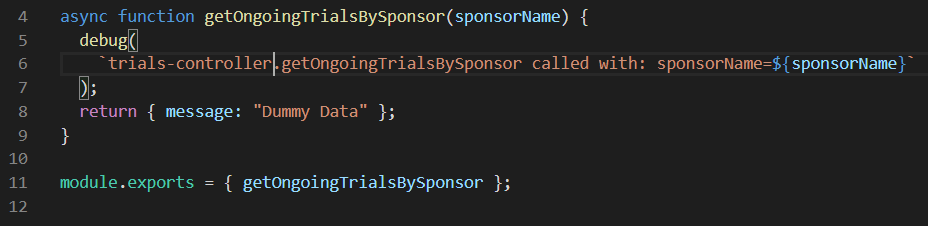
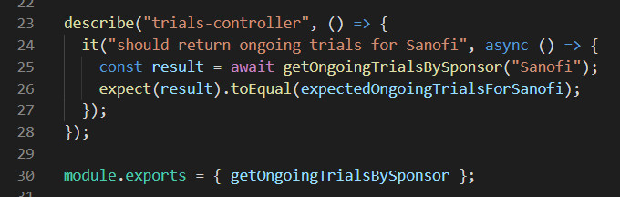
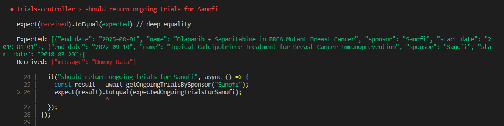

# Inato - clinical trial tool

## Purpose

Sample project for a nodeJs Api and a  (command line interface) using this api. 

## Setup

### Initialize packages by running (at the root)

```
yarn
```

yarn is used to build the root and all workspaces at the same time.

### Start the project

```
npm start
```

PS: you can use yarn as well

By default the project will run with the env var `SAMPLE_MODE` in the [server start script](.\packages\server\package.json) in order to test the application manually. In production, this var should be disabled.

### Launch/Install the command line `baker-cli` locally

There are 2 options

- You can launch the command line locally

```
npm run cli
```

- OR you can install the package globally

```
npm i -g ./packages/baker-cli
```

### Test the server

- run the automatic tests (10 tests)

```
npm test
```

- In a browser: http://localhost:3033
- With [Rest Client Extension](https://marketplace.visualstudio.com/items?itemName=humao.rest-client) for VSCode you can use the [sample requests](.\packages\server\tests\manual\trials.http) file.

4. Test the command line

Start the server THEN run one of those commands from any directory:

```
baker-cli
baker-cli -h
baker-cli list
baker-cli list -c FR
baker-cli list -c DE
baker-cli list -c france
```

The first one is a Question/Answer cli.

## Technical choices

### Monorepo with Yarn Workspaces

I've chosen to use a monorepo because it's a clean structure grouping multiple projects in a single version control repository. It allows having clean boundaries like multiple repo but at the same time has many other benefits:

- To get a consistent view of all projects (for better code navigation, refactoring, local tests experience).
- To be able to make an atomic change on multiple packages.
- To reduce the need of configuration to manage versions (Yarn Workspaces do a lot of transparent work to optimize this)

In our company (40 dev/9 teams), the experience of monorepo (more than 100 packages for each part of the site) was really positive.

I still use npm and not yarn as package manager (except workspaces) because I'm more used to it.

### Express setup with express-generator

To generate the boilerplate code of a NodeJS Express server I used [express-generator](https://www.npmjs.com/package/express-generator) that gives a clean structure (app.js, bin/www, public, /routes). After this setup I've added cross-env (because I'm on windows) and put the port to 3033 (just to not have conflicts with other projects locally).

### Test-driven development (TDD)

I've used the following tdd approach:

1. Create an empty endpoint and controller. (could have been done afterwards as well)



2. Create a test on the controller



3. Run the test and let it fail as expected



4. Implement the feature in the controller to fix the test.
5. Run the test to check it passes. if not come back to the step 4.
6. Refactor the code if it's useful and check all tests are still passing.
7. Go back to step 2 to cover more use cases (happy path or errors).

### Http calls

I've used Axios for http calls because it's less work, a better syntax and avoids some bugs.

### Error management

On the server, the global error handling (handleValidationError and handleAllError) takes care of any Error raised in the business code (router, controllers, adapters).
With the addition of `wrapAsync` the business code doesn’t have to handle error management in asynchronous code. All errors will bubble up to the global error handlers.
Customs errors (like ConnectivityError) helps to carry some specific edge cases. ValidationError is not used but I keep it in the code to show how I would handle it.

### Testing strategy

I've used different strategies for tests:

#### Controller tests

[Tests on the controller](.\packages\server\controllers\trials-controller.test.js) check only the controller logic in isolation. The adapter to the third party api is injected in the constructor.

#### Route tests

[Tests on the route](.\packages\server\routes\trials.test.js) check the full endpoint (route, controller, adapter). The http calls are mocked with the library nock.

#### Manual tests

[sample requests](.\packages\server\tests\manual\trials.http) can be used for smoke tests.

### CLI runner

The CLI can be installed globally. It runs with commander to parse the command line and inquirer to give a nice interactive UI.

## To go further

We could have also:

- created an API documentation with Swagger
- used TypeScript instead of Js
- developed a GraphQL server instead or on top of the REST API
- improved code coverage
- created unit tests in the cli

## Thank you!
